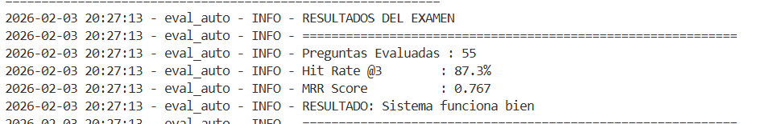
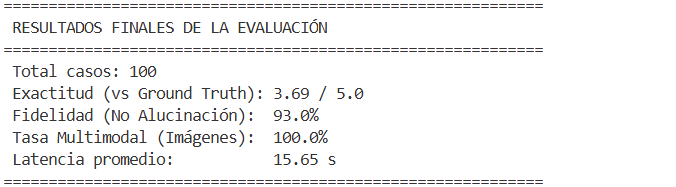

# 🏛️ Cicerón: Asistente Turístico Multimodal e Inteligente


Un sistema de recuperación aumentada (RAG) avanzado capaz de planificar viajes a Japón y España, integrando búsqueda híbrida, reordenamiento semántico y respuesta multimodal.

## 📖 Descripción del Proyecto

**Cicerón** es un sistema avanzado de *Retrieval-Augmented Generation* (RAG) especializado en turismo para **Japón y España**. 

Cicerón es **Multimodal** que entiende texto y responde con texto e imagenes. Utiliza una arquitectura de agentes para garantizar que la información sea veraz, utilizando guías oficiales y no el conocimiento general alucinado de un LLM.

---

## 📂 Estructura del Proyecto
```text

├── 📂 data/                          # Almacén de datos
│   ├── 📂 imagenes_extraidas/        # Imágenes procesadas para multimodalidad
│   └── 📂 pdf/                       # PDFs fuente, Golden Sets (JSONL) y reportes visuales
│
├── 📂 chroma_db_multimodal/          # Base de datos vectorial persistente
│
├── 📂 src/                           # Código Fuente
│   │
│   ├── 📂 app/                       # Frontend e Interfaz
│   │   ├── 📂 img/                   # Recursos gráficos de la app
│   │   ├── 04_APP.py                 # Punto de entrada de la aplicación Streamlit
│   │   └── style.css                 # Hoja de estilos (CSS)
│   │
│   ├── 📂 evaluacion_modelo/         # Scripts de Ingesta, RAGAS y Métricas
│   │   ├── ground_truth.py           # Generación de dataset de verdad (Ground Truth)
│   │   ├── ragas.py                  # Evaluación del modelo usando librería Ragas
│   │   └── reporte_evaluacion_*.csv  # Reportes de métricas generados
│   │
│   ├── 01_Ingesta_multimodal_metadata.py # ETL: Procesamiento y vectorización
│   ├── 02_evaluar_chunks.py      # Script de evaluación de fragmentación
│   ├── 03_API_Separada.py            # Backend: API REST con FastAPI
│   ├── modelo_base.py                # Orquestador principal del flujo RAG
│   ├── query_rewriting.py            # Módulo de reescritura de consultas
│   ├── reranker.py                   # Sistema de Re-ranking (Cross-Encoder)
│   ├── rrf.py                        # Fusión de resultados (Reciprocal Rank Fusion)
│   ├── semantic_router.py            # Enrutamiento semántico de intenciones
│   └── utils.py                      # Funciones auxiliares y configuración
│
├── .env                              # Variables de entorno (API Keys)
├── requirements.txt                  # Dependencias del proyecto
├── .gitignore
└── README.md                         # Documentación
```
---

## 🚀 Arquitectura RAG

El proyecto implementa cuatro capas críticas de recuperación para maximizar la precisión:

### 1. 🧠 Query Rewriting (Reescritura)
Transforma entradas ambiguas en consultas optimizadas. 
* *Ejemplo:* de "sitios japo madrid" ➔ "mejores restaurantes de gastronomía japonesa auténtica en Madrid".

### 2. 🚦 Semantic Routing (Enrutamiento)
Analiza la intención del usuario para segmentar el espacio de búsqueda. Si buscas sobre "Tokio", el sistema aplica filtros de metadatos para ignorar documentos de "España", reduciendo drásticamente el ruido.

### 3. 🤝 Hybrid Search & RRF
Combina dos metodologías de búsqueda mediante **Reciprocal Rank Fusion**:
* **Búsqueda Semántica:** Entendimiento contextual mediante Embeddings.
* **BM25:** Búsqueda por palabras clave para términos exactos y nombres propios.

### 4. ⚖️ Cross-Encoder Reranking
Los resultados no solo se recuperan, se reevalúan. Utilizamos el modelo **BGE-Reranker** para puntuar la relevancia real de cada documento antes de enviarlo al LLM, asegurando que la respuesta final sea de máxima calidad.

---

## 🛠️ Capacidades Adicionales

| Característica | Descripción |
| :--- | :--- |
| **Multimodalidad** | Recuperación de imágenes mediante embeddings **CLIP** (Texto a Imagen). |
| **Seguridad** | Capas de filtrado de entrada para prevenir ataques de **Prompt Injection**. |
| **Memoria** | Recoge en un historial la informacion. |

---

## 🏗️ Arquitectura Técnica

El sistema sigue el patrón de diseño de microservicios para desacoplar la lógica de la interfaz.

### 🛠️ Stack Tecnológico
* **Backend:** `FastAPI` (Gestión de rutas, asincronía y lógica RAG).
* **Frontend:** `Streamlit` (Interfaz de chat con soporte de imágenes).
* **Base de Datos Chroma:** `ChromaDB` (Colecciones separadas para texto e imágenes).

---
### 🧠 Modelos Implementados
Para lograr la máxima puntuación en precisión, utilizamos una estrategia **Multi-LLM**:

| Componente | Modelo | Función |
| :--- | :--- | :--- |
| **Embeddings** | `intfloat/multilingual-e5-large` | Búsqueda semántica de alta calidad en español. |
| **Reranker** | `BAAI/bge-reranker-v2-m3` | Reordenamiento (Cross-Encoder) para precisión crítica. |
| **Visión** | `CLIP` / `GPT-4o` | Procesamiento y descripción de imágenes turísticas. |
| **Generación** | `GPT-4o` / `Llama-3` | Respuesta final al usuario. |
| **Router** | `Semantic Router` (Custom) | Clasificación de intención (País/Tema). |

---

## 📊 Evaluación y Métricas (Evidencias)

A continuación se presentan las evidencias de rendimiento del sistema, requisito fundamental para la validación técnica.

### 1. Evaluación del Retrieval (Comparativa de Chunks)
Se realizaron pruebas con distintos tamaños de chunk para encontrar el balance entre contexto y precisión.

> **Captura de los resultados del script `02_evaluar_chunks.py`:**

  
*(Si no carga la imagen: Hit Rate promedio de 0.88 con chunks de 512 tokens)*

### 2. Evaluación de Generación (RAGAS / LLM-Judge)
Utilizando un "Golden Set" (preguntas con respuestas ideales), evaluamos la fidelidad y relevancia de Cicerón.

> **Captura de los resultados del script `ragas.py`:**



* **Fidelidad:** Mide si el modelo inventa datos. (Objetivo > 90%)
* **Exactitud:** Comparación semántica con la respuesta ideal.
* **Multimodalidad:** Porcentaje de veces que recuperó una imagen correcta.
* **Latencia:** Promedio de tiempo que tarda en responder la RAG.

---

## ⚙️ Instalación y Despliegue

### Requisitos Previos
* Python
* Clave de OpenAI (`OPENAI_API_KEY`)


### ¡Ejecución Manual
Observacion: Para que la RAG genere respuesta debes tener en cuenta que la base de datos debe estar creada.

```bash
# 1. Instalar dependencias
pip install -r requirements.txt

# 2. Iniciar el Servidor (Backend)
uvicorn src.03_API_Separada:app --reload

# 3. Iniciar la App (Frontend) en otra terminal
streamlit run src/04_APP.py
